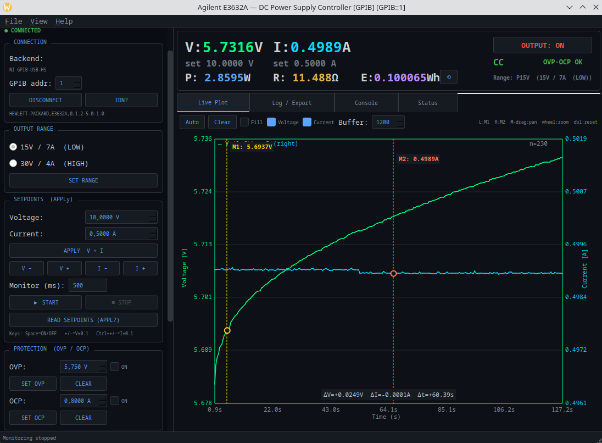

# Agilent E3632A DC Power Supply Controller

This is a PyQt5 control GUI for the [Agilent E3632A](ihttps://www.keysight.com/us/en/product/E3632A/120w-power-supply-15v-7a-30v-4a.html) 
120 W DC power supply (15 V/7 A and 30 V/4 A ranges) over GPIB.

It builds on my previous [ADC7352aE GUI](https://github.com/Najsztub/adce7352a-gui).



## Features

- **GPIB backend via ni-gpib-usb-hs** (address configurable 0–30, default 1;
  mock backend exists only for the pytest suite)
- **Output range** P15V (15 V/7 A, LOW) / P30V (30 V/4 A, HIGH) with setpoint clamping per Table 4-1
- **APPLy setpoints** — voltage + current in one command, plus UP/DOWN stepping
- **Output ON/OFF** with live CV/CC inference (the E3632A exposes no CV/CC query;
  CC is inferred when current sits at the limit while voltage is below setpoint)
- **Live V/I monitor** — dual-trace strip chart, output/mode badge, CSV/TXT logging
- **Live power (W) + energy (Wh/J)** — P = V·I in the display panel, energy
  integrated over monitor time with ⟲ reset (joules in tooltip, Wh+J in Status tab)
- **Protection** — OVP/OCP level + state + tripped/clear
- **Trigger** — source (BUS/IMM), delay, VOLT:TRIG/CURR:TRIG, INIT, *TRG
- **System** — *RST, *TST?, beeper, display on/off + 12-char message, *SAV/*RCL 1–3,
  GO TO LOCAL (IEEE-488 GTL)
- **Local control restored on disconnect** — DISCONNECT and window close send
  GTL first (the adapter keeps REN asserted otherwise, leaving the supply in
  Rmt with a locked panel); output settings are preserved
- **Status tab** — live state, error-queue drain, *STB?/*ESR?/Questionable registers, CAL count
- **Console tab** — raw SCPI entry with autocomplete and history
  (queries use read; bare commands use write + `SYST:ERR?` check — a read after
  a bare command would hang the GPIB bus until timeout)
- **Dark / Light theme** toggle (persisted via QSettings)

## Interface setup

The SCPI command set is implemented from the **E3632A User's Guide,
Chapter 4 "Remote Interface Reference"**. The user's guide is available on the internet.

I used a NI GPIB to USB converter. I had some problems to make it work with the native Fedora GPIB kernel drivers, 
so the GPIB transport uses the pure-Python user-space driver for the
**NI GPIB-USB-HS** adapter from <https://github.com/embeddedci-com/ni-gpib-usb-hs>
(`pyusb` + `libusb`, no NI-488.2 / `linux-gpib` kernel module required).

Linux permissions for the adapter (root-owned USB node by default):

```bash
sudo cp $(python -c "import ni_gpib_usb_hs, os; print(os.path.dirname(ni_gpib_usb_hs.__file__))")/../udev/99-ni-gpib-usb-hs.rules \
  /etc/udev/rules.d/ 2>/dev/null || \
sudo cp udev/99-ni-gpib-usb-hs.rules /etc/udev/rules.d/
sudo udevadm control --reload-rules && sudo udevadm trigger
```

The repo ships its own copy under `udev/` as well.

## Requirements

- Python 3.8+
- PyQt5, numpy, pyusb, ni-gpib-usb-hs
- libusb native library (`libusb-1.0-0` — usually already present on Linux)

## Quick Start

```bash
pip install -r requirements.txt

# Real hardware at GPIB address 1
python main.py

# Real hardware at another address
python main.py --addr 5
```

The top display bar shows measured **V / I**, programmed **set V / set I**,
**P (W) / R (Ω) / E (Wh)** (R = V/I, hidden below 0.5 mA), plus the OUTPUT
ON/OFF button and the CC/CV and OVP/OCP badges (protection trips are polled
every 10th monitor cycle).
Power/energy use `max(0, I)` so noise around zero can never make them negative.

Keyboard control (applied immediately on keypress, never while typing in a field):

| Key | Action |
|-----|--------|
| `Space` | Output ON/OFF (also auto-starts monitoring when turning on) |
| `+` / `−` | Voltage setpoint ±0.1 V |
| `Ctrl`+`+` / `Ctrl`+`−` | Current setpoint ±0.1 A |

The Live Plot mirrors the adce7352a plot UX: crosshair with snapped V/I/t
readout, M1 (left click) / M2 (right click) cursors with ΔV/ΔI/Δt box,
middle-drag pan, wheel Y-zoom (left = V, right = I), Ctrl+wheel X-zoom,
double-click/Auto to reset, Fill toggle, V/I toggles, buffer size.

## Architecture

```
gui/
├── commands/
│   └── e3632a_commands.py # Ranges (Table 4-1), limits, SCPI registry
├── instruments/
│   ├── e3632a.py          # Unified driver (GPIB + mock)
│   ├── gpib_backend.py    # Thread-safe NIUSBGPIB wrapper (addr 1)
│   └── mock_backend.py    # Simulated PSU with CV/CC load model
├── core/
│   ├── config.py          # QSettings persistence
│   ├── theme.py           # Dynamic color scheme per theme
│   └── worker.py          # Monitor worker (QThread, MEAS:VOLT?/CURR?)
├── ui/
│   ├── main_window.py     # 3-pane main window
│   └── tabs/
│       ├── console_tab.py # SCPI console (write vs query aware)
│       ├── log_tab.py     # CSV/TXT logging
│       └── status_tab.py  # Protection, errors, registers, self-test
├── plotting/
│   └── vi_plot.py         # Dual-trace V/I strip chart (QPainter)
├── resources/
│   ├── styles.qss         # Dark theme
│   └── light.qss          # Light theme
└── tests/
    └── test_e3632a.py     # Mock + hardware test suite
main.py                    # Entry point (--mock/--real/--addr)
```

### Monitor Cycle

Each cycle performs `MEAS:VOLT?` + `MEAS:CURR?`, and every 5th cycle adds
`OUTP?` + `APPL?` (for the CV/CC inference and badge) to keep GPIB traffic low.

## Tests

```bash
python -m pytest gui/tests/test_e3632a.py -v          # mock backend
python -m pytest gui/tests/test_e3632a.py -v --real   # real GPIB addr 1
```

The `--real` run restores setpoints (5 V/1 A), range (P15V), OVP (5.75 V),
OCP (0.8 A) and trigger defaults afterwards. Output state is restored.

## Safety Notes

- The GUI clamps setpoints to the selected range, but **verify wiring and
  limits before enabling the output** — this is a 120 W supply.
- `*RST` asks for confirmation; OVP/OCP are ON at 32 V/7.5 A after reset.
- Clearing a tripped protection without removing the cause will trip again.

# Disclaimer

Developed with LLM assistance. Verified against a real E3632A
(`HEWLETT-PACKARD,E3632A,0,1.2-5.0-1.0`) via NI GPIB-USB-HS.
No responsibility for program outcomes; code is free to reuse.

## License

MIT — see [LICENSE](LICENSE).
